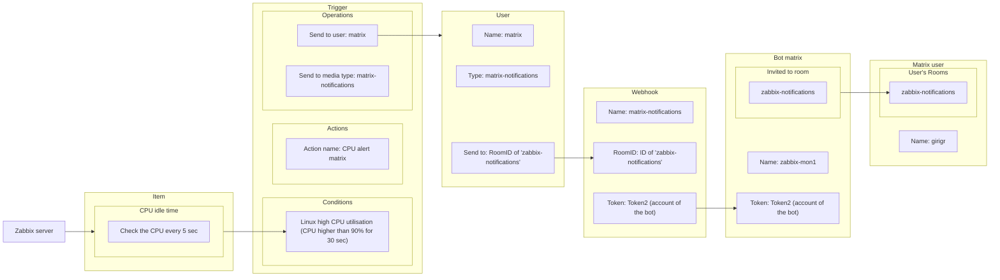

```mermaid

flowchart LR

subgraph itemCpu["CPU idle time"]
        itemCpuCheck["Check the CPU every 5 sec"]
end

subgraph item["Item"]
        itemCpu
end

subgraph triggerActions["Actions"]
        triggerAction["Action name: CPU alert matrix"]
end

subgraph triggerConditions["Conditions"]
        triggerCondition["Linux high CPU utilisation (CPU higher than 90% for 30 sec)"]
end

subgraph triggerOperation["Operations"]
        triggerOperationUser["Send to user: matrix"]
        triggerOperationMedia["Send to media type: matrix-notifications"]
end

subgraph trigger["Trigger"]
        triggerActions
        triggerConditions
        triggerOperation
end

subgraph user["User"]
        userName["Name: matrix"]
        userType["Type: matrix-notifications"]
        userSend@{ label: "Send to: RoomID of 'zabbix-notifications'" }
end

subgraph webhook["Webhook"]
        webhookName["Name: matrix-notifications"]
        webhookRoom@{ label: "RoomID: ID of 'zabbix-notifications'" }
        webhookToken["Token: Token2 (account of the bot)"]
end

subgraph botInvites["Invited to room"]
        botInvitesRoom["zabbix-notifications"]
end

subgraph bot["Bot matrix"]
        botName["Name: zabbix-mon1"]
        botToken["Token: Token2 (account of the bot)"]
        botInvites
end

subgraph matrixUserRooms["User's Rooms"]
        matrixUserRoomsZabbix["zabbix-notifications"]
end

subgraph matrixUser["Matrix user"]
        name["Name: girigr"]
        matrixUserRooms
end
    zabbixServer["Zabbix server"] --> itemCpu
    itemCpu --> triggerCondition
    triggerOperationUser --> user
    userSend --> webhookRoom
    webhookToken --> botToken
    botInvites --> matrixUserRoomsZabbix
    userSend@{ shape: rect}
    webhookRoom@{ shape: rect}
```
