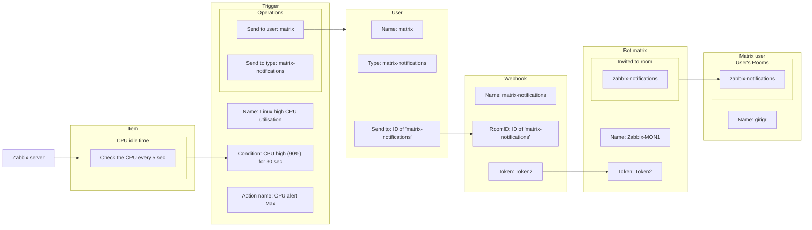

# This diagram shows how thes matrix's notifications works

```mermaid
flowchart LR
 subgraph itemCpu["CPU idle time"]
        itemCpuCheck["Check the CPU every 5 sec"]
  end
 subgraph item["Item"]
        itemCpu
  end
 subgraph triggerOperation["Operations"]
        triggerOperationUser["Send to user: matrix"]
        triggerOperationMedia["Send to type: matrix-notifications"]
  end
 subgraph trigger["Trigger"]
        triggerName["Name: Linux high CPU utilisation"]
        triggerCondition["Condition: CPU high (90%) for 30 sec"]
        triggerAction["Action name: CPU alert Max"]
        triggerOperation
  end
 subgraph user["User"]
        userName["Name: matrix"]
        userType["Type: matrix-notifications"]
        userSend@{ label: "Send to: ID of 'matrix-notifications'" }
  end
 subgraph webhook["Webhook"]
        webhookName["Name: matrix-notifications"]
        webhookRoom@{ label: "RoomID: ID of 'matrix-notifications'" }
        webhookToken["Token: Token2"]
  end
 subgraph botInvites["Invited to room"]
        botInvitesRoom["zabbix-notifications"]
  end
 subgraph bot["Bot matrix"]
        botName["Name: Zabbix-MON1"]
        botToken["Token: Token2"]
        botInvites
  end
 subgraph matrixUserRooms["User's Rooms"]
        matrixUserRoomsZabbix["zabbix-notifications"]
  end
 subgraph matrixUser["Matrix user"]
        name["Name: girigr"]
        matrixUserRooms
  end
    zabbixServer["Zabbix server"] --> itemCpu
    itemCpu --> triggerCondition
    triggerOperationUser --> user
    userSend --> webhookRoom
    webhookToken --> botToken
    botInvites --> matrixUserRoomsZabbix
    userSend@{ shape: rect}
    webhookRoom@{ shape: rect}
    
```
