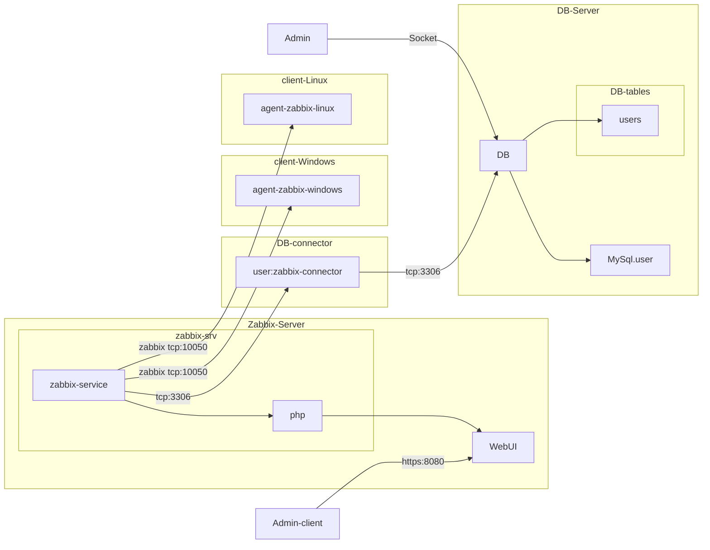

```mermaid
flowchart LR
 subgraph subGraph6["zabbix-srv"]
        zabbix-srv["zabbix-service"]
        php["php"]
  end
 subgraph subGraph0["Zabbix-Server"]
        subGraph6
        WebUI["WebUI"]
  end
 subgraph subGraph5["DB-tables"]
        users["users"]
  end
 subgraph subGraph1["DB-Server"]
        DB["DB"]
        MySql.user["MySql.user"]
        subGraph5
  end
 subgraph subGraph2["client-Windows"]
        agent-zabbix-windows["agent-zabbix-windows"]
  end
 subgraph subGraph3["client-Linux"]
        agent-zabbix-linux["agent-zabbix-linux"]
  end
 subgraph subGraph4["DB-connector"]
        user:zabbix-connector["user:zabbix-connector"]
  end
    zabbix-srv -- zabbix tcp:10050 --> agent-zabbix-linux & agent-zabbix-windows
    Admin["Admin"] -- Socket --> DB
    zabbix-srv -- tcp:3306 --> user:zabbix-connector
    user:zabbix-connector -- tcp:3306 --> DB
    DB --> MySql.user & users
    zabbix-srv --> php
    php --> WebUI
    Admin-client["Admin-client"] -- https:8080 --> WebUI
```
