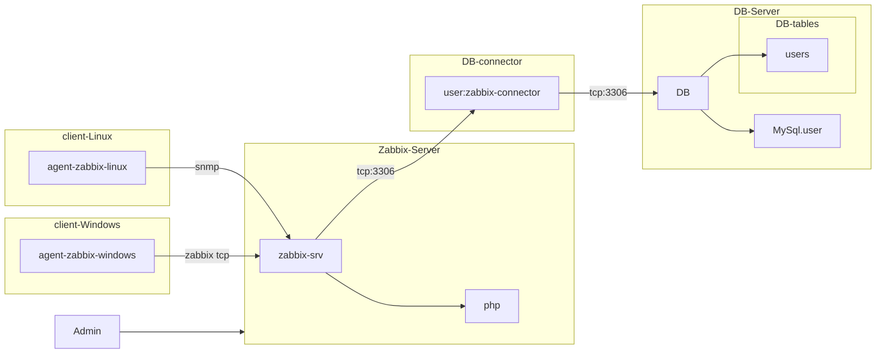

```mermaid
flowchart LR
Admin
 subgraph subGraph0["Zabbix-Server"]
    zabbix-srv
    php
  end

  Admin
 subgraph subGraph1["DB-Server"]
    DB
    MySql.user
    subgraph subGraph5["DB-tables"]
    users
    end
 end
  subgraph subGraph4["DB-connector"]
  user:zabbix-connector
  end
  Admin-->subGraph0
subgraph subGraph2["client-Windows"]
agent-zabbix-windows
end
subgraph subGraph3["client-Linux"]
agent-zabbix-linux
end
agent-zabbix-linux--snmp-->zabbix-srv
agent-zabbix-windows--zabbix tcp-->zabbix-srv
zabbix-srv--tcp:3306-->user:zabbix-connector
user:zabbix-connector--tcp:3306-->DB
DB-->MySql.user
DB-->users
zabbix-srv-->php
```

