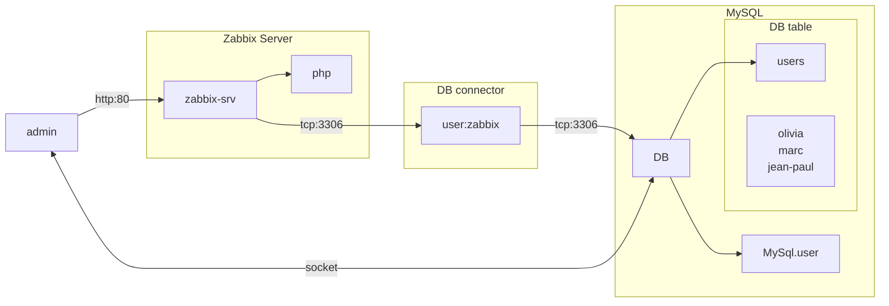

# Schéma de la connexion entre un administrateur et la base de données en passant par le serveur zabbix

```mermaid
graph LR;
    admin--http:80-->zabbix-srv;
    subgraph Zabbix Server ;
        zabbix-srv-->php;
    end
    zabbix-srv--tcp:3306--->user:zabbix;
    subgraph DB connector;
        user:zabbix
    end
    user:zabbix--tcp:3306-->DB;
    DB<--socket-->admin
    subgraph MySQL;
        DB-->MySql.user
        DB-->users
        subgraph DB table;
            users["users"]
            user["`olivia
            marc
            jean-paul`"]
        end
    end
    
```
